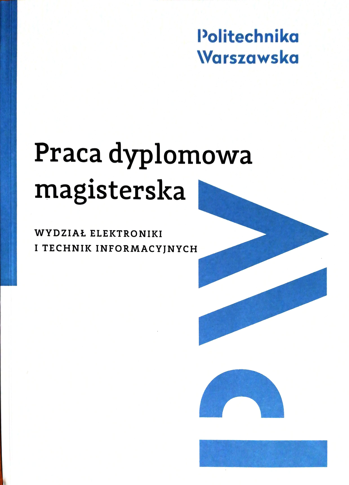

# [Master Thesis] Transfer learning in paraphrase detection for English and Spanish languages


Supervisor: dr inż Piotr Andruszkiewicz

Warsaw University of Technology, Poland


## Abstract [English, Ukrainian, Polish]

Abstract is here [abstract_en_ua_pl.md](abstract_en_ua_pl.md)


## Folder structure description

```
- data		- embeddings and datasets
- notebooks	- code of experiments
- results	- gathered and processed outputs of experiments described in thesis
  |- 1-parameters-choosing	- preparational experiments before main training
  \- 2-main-training		- training of EN, ES models, EN model retraining and further training of ES model
```

## Data

Embeddings should be downloaded separately from original repo. See README in 'kod/data/embeddings/fasttext/multi/'.


## Running notebooks

### Before running.

To run code you need to have some python packages, to install run the command below:

```
pip3 install tensorflow==1.12 keras numpy scikit-learn matplotlib nltk bs4 contractions inflect textsearch
```

**Note 1** TensorFlow version must be >=1.12 and <=1.14 (tested).

**Note 2** For running on GPU install `tensorflow-gpu` instead of `tensorflow`.

**Note 3** For help with GPU installation of TF and/or downloading used python wheel which I compiled look [here](https://github.com/maks-ym/tensorflow-gpu-installation)


### Running

Running these notebooks is the same as runing any typical Jupyter notebook:
- go to the 'kod' directory in terminal and run "jupyter notebook"
- in browser choose notebook you want to run

<br>

